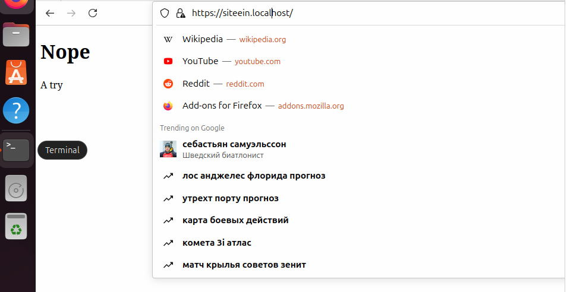
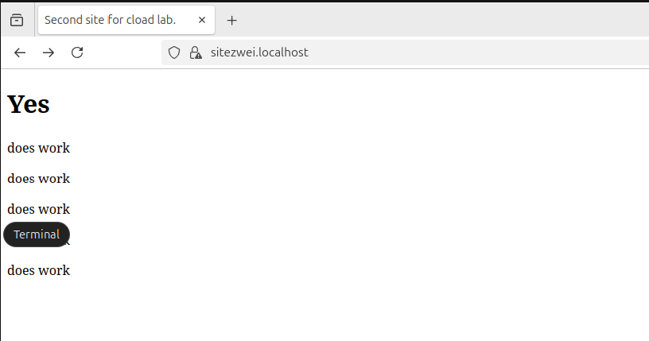

Лабораторная работа №1

Перед установкой nginx мне пришлось сначала установить менеджер пакетов Homebrew и утилиту Curl:

Затем наконец удалось установить nginx:

Затем я ввёл запустил nginx:

brew services start nginx 

Посмотрев в интернете как создавать SSL-сертификаты, я ввёл эту команду:
openssl req -x509 -nodes -days 365 -newkey rsa:2048 -keyout nginx-selfsigned.key -out nginx-selfsigned.crt
И заполнил ответы на вопросы данными моей фиктивной компании:

Файл конфигурации nginx у меня, почему-то не создался, я посмотрел в интернете и по совету со StackOverflow
установил nginx-core, после чего файл появился: 

Затем я создал папки для файлов сайтов и создал сами сайты:

Затем я создал серверы для сайтов со встроенной переадресацией портов, чтобы выполнить условние задания
и добавил внутрь подтягивание ключа из папки:

Потом я внёс мои сайты в /etc/hosts:

Затем я нашёл себе напарника, потому что почему-то ничего не работало.
Вместе мы стали диагностировать. Сначала мы исправили файлы, потому что nginx не мог их найти. Тогда оно заработало, но оба сайта
выдавали одно и то же. Мы пытались настроиили hosts, затем безуспешно пытались перезагрузить nginx и корректировать файлы,
но всё успешно заработало, когда мы убили процесс Firefox. Вот работающие сайты:

