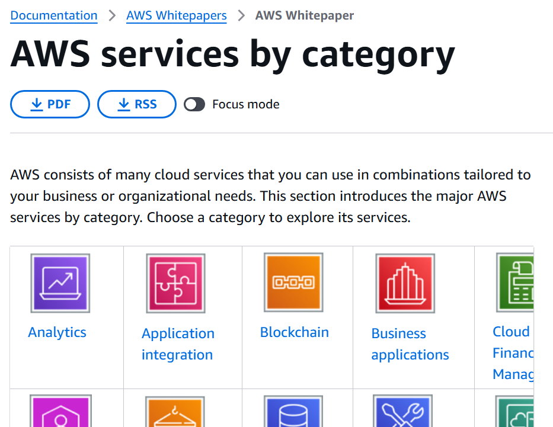
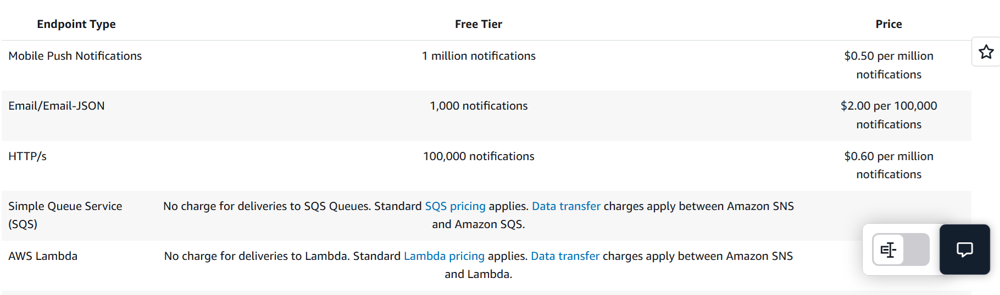

# Лабораторная рабора №1, вариант 10. 

## Цель работы

Знакомство с облачными сервисами. Понимание уровней абстракции над инфраструктурой в облаке. Формирование понимания типов потребления сервисов в сервисной-модели. 

## Ход работы

Мы заполнили пустые поля в таблице, ссылаясь на официальную документацию AWS.
https://aws.amazon.com/
https://docs.aws.amazon.com/

---
## Сервисы

### Amazon S3
Хранилище данных. Используется для хранения и доступа к резервным копиям, логам, медиафайлам и аналитическим данным. В отличие от SSD-дисков, обеспечивает высокую масштабируемость и автоматическое восстановление при частичной потере данных.

*Российский аналог – Yandex Object Storage*

### Amazon QLDB
Управляемый журналом транзакций с неизменяемой историей записей, который сохраняет все изменения данных и позволяет проверять их целостность и подлинность. В отличие от обычных баз данных, QLDB не позволяет администратору незаметно скорретировать запись, удалить лог и вызвать устаревшую резевную копию, обеспечивая полный аудит изменений. Это делает сервис подходящим для финансовых и юридических систем, где важна проверяемость данных. 

*Российский аналог – «Конфидент» от Web3 Tech, «Мастерчейн»*

### Amazon Redshift
Аналитическая база данных, оптимизированная для обработки сложных запросов к большим объёмам данных. Оптимизация достигается за счёт колоночного хранения, параллельной обработки запросов и автоматического распределения данных по узлам кластера, что повышает скорость аналитических операций. 

*Российский аналог – Arenadata Analytical DB, работающая под управлением РЕД ОС и Astra Linux*

### Amazon VPC
Virtual Private Cloud. Позволяет создавать изолированную виртуальную сеть внутри облачной инфраструктуры провайдера. В рамках VPC пользователь самостоятельно определяет адресное пространство, подсети, маршруты и правила доступа, что обеспечивает логическую изоляцию ресурсов и контроль сетевого трафика. Препятствует попаданию данных компании в Интернет или к другим клиентам провайдера инфраструктуры, утечкам данных внутри организации. 

*Российский аналог – Yandex Cloud*

### Amazon SES
Simple Email Service. Предназначен для отправки и приёма электронных писем в рамках приложений и сервисов. Используется для массовых рассылок, транзакционных уведомлений и сервисных сообщений, обеспечивая масштабируемость и контроль доставки писем.

*Российский аналог – Unisender Go*

### Amazon SNS
Simple Notification Service. Позволяет отправлять уведомления получателям через разные каналы, включая HTTP, email, SMS и очереди сообщений.

*Российский аналог – Yandex Cloud Notification Service*

--- 
# Вывод
Большинство сервисов невозможно отнести к единственной категории (Paas, Iaas, Saas). Однако мы узнали много новой информации про различные сервисы инфраструктуры компании Amazon и поняли как их можно классифицировать.

