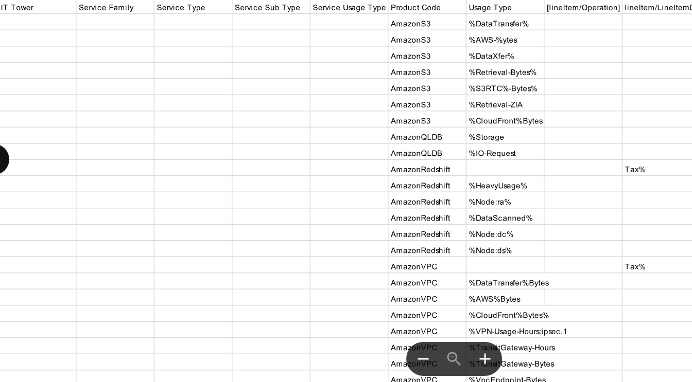

# Лабораторная рабора №1. Знакомство с IaaS, PaaS, SaaS сервисами в облаке на примере Amazon Web Services (AWS). Создание сервисной модели.

## Цель работы

Знакомство с облачными сервисами. Понимание уровней абстракции над инфраструктурой в облаке. Формирование понимания типов потребления сервисов в сервисной-модели. 

## Ход работы

Для начала работы мы выбрали вариант файла №10.

