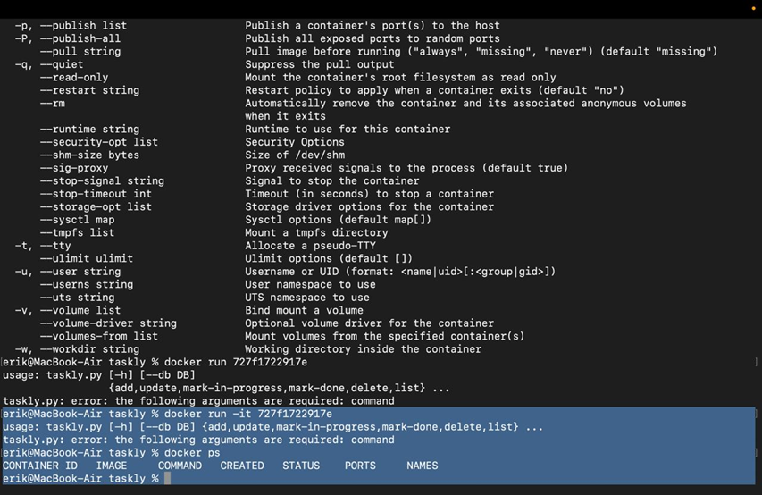
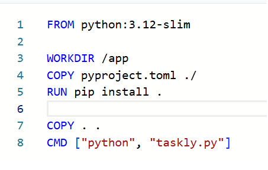
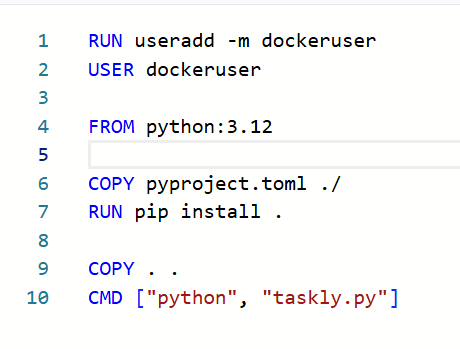
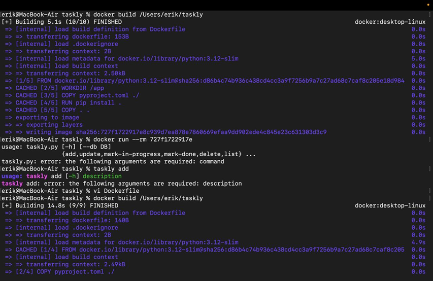

Лабораторная работа 2.

Для того чтобы не запускать просто программу «Hello World», мы скачали из интернета случайную программу на Pyhton
и решили сделать докерфайл на основе неё. 

На основе этого нормального докерфайла мы сделали вот это убогий докерфайл:

В нём были намеренно введены следующие глупости:

1 - В докерфайле выдаются root-права. При непредвиденном поведении, наличие таких прав может нанести большой ущерб окружению.

2 - В докерфайле скачивается весь Python целиком, из-за чего занимается гораздо больше места и будет тратиться значительно больше времени.

3 - В докерфайле не прописано куда именно будут устанавливаться файлы, поэтому установка может произойти куда-попало.

В результате этого, как минимум, время на выполнение увеличилось в три раза:

Часть 2 - Контейнеры

Посмотрев в интернете различные гайды по созданию хороших контейнеров, мы выделили следующие два пункта как наиболее важные:

1 - хранение данных, особенно ценных внутри контейнера. Хранить ценные данные в работающем контейнере и не дублировать их, например, в Docker Volumes - плохая идея, потому что данные будут невосстановимо потеряны с закрытием контейнера.

2 - использование одного контейнера для совсем разных задач. Например нельзя допускать ситуацию, когда один и тот же докерфайл используется для производства и на защищенных серверах.
Наличие всякого мусора и артефактов разработки в контейнерах может негативно сказаться на безопасности и стабильности работы.
